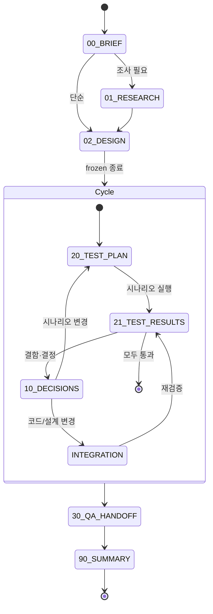
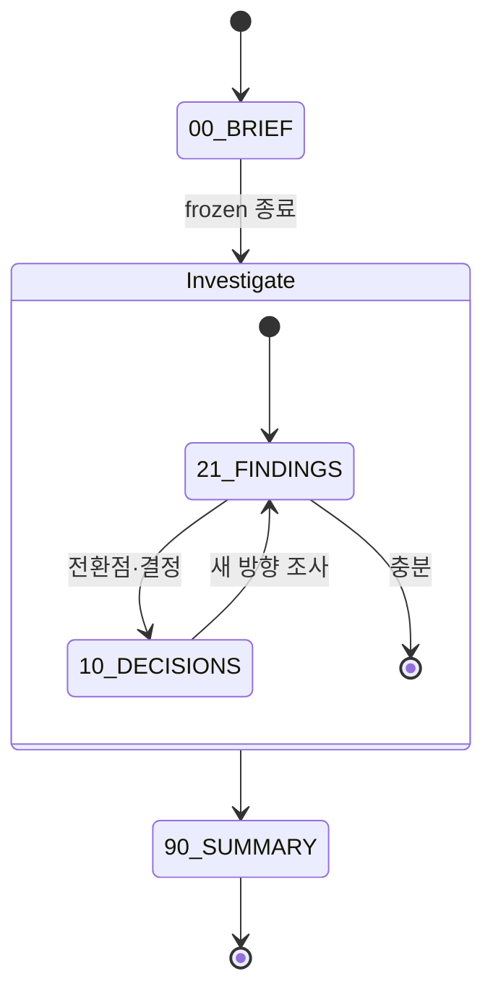

# Context Engineering System — 설계 문서

**최초 작성:** 2026-05-08
**최신 개정:** 2026-05-12 (firescout data-retention 실사용 학습 + 브레인스토밍 반영, 빌드 직전)
**상태:** 설계 확정, 빌드 대기

---

## 0. 동기

매 작업마다 산출물의 형태·순서·저장 위치가 ad-hoc 했음. 같은 종류 작업도 매번 다른 구조로 만들어져 추적·재현·재개가 어려움. CLAUDE.md 한 줄로 4가지 타입을 일관된 형식으로 진행시키고, 산출물 폴더가 곧 작업의 맥락(context)이 되도록 한다.

---

## 1. 4 Task Type 정리

| Type | 트리거 예 | 슬래시 | 산출물 폴더 |
|------|-----------|--------|-------------|
| Feature | "구현/만들어/추가/기능" | `/ce-feature <name>` | `features/YYMMDD-<name>/` |
| Project | "프로젝트/여러 기능/통합 개발" | `/ce-project <name>` | `projects/YYMMDD-<name>/` |
| Research | "조사/비교/검토" (코드 변경 X) | `/ce-research <topic>` | `research/YYMMDD-<topic>/` |
| QnA | 단순 질문 | `/ce-qna <topic>` | `qna/YYMMDD-<topic>.md` (단일 파일) |

---

## 2. 폴더 / 파일 구조

### 2.1 산출물 폴더 — 공통 컨벤션

- prefix: `YYMMDD-` (시작 날짜)
- 외부 링크 마커: `[CONF]`, `[JIRA]` (export 후 자동 추가, 알파벳 순)
- 예시:
  ```
  260508-data-retention                       (외부 링크 없음)
  260508-[CONF]-data-retention                (Confluence 연동)
  260508-[JIRA]-data-retention                (Jira 연동)
  260508-[CONF][JIRA]-data-retention          (둘 다, 알파벳 순)
  ```

### 2.2 Skill 정의 (user-level, 배포본)

```
~/.claude/
├── CLAUDE.md                                  ← Context Engineering 섹션 추가
└── skills/
    └── context-engineering/
        ├── SKILL.md                           ← 진입점 (type 분류 가이드)
        ├── feature/
        │   ├── SKILL.md
        │   └── templates/
        ├── project/
        │   ├── SKILL.md
        │   └── templates/
        ├── research/
        │   ├── SKILL.md
        │   └── templates/
        ├── qna/
        │   ├── SKILL.md
        │   └── templates/
        ├── modify/                            ← 메타 skill (req#3)
        │   └── SKILL.md
        ├── export/                            ← 메타 skill (req#4)
        │   └── SKILL.md
        └── CHANGELOG.md                       ← Skill 자체 변경 이력
```

### 2.3 Feature 작업 폴더

```
features/YYMMDD[-CONF][-JIRA]-<name>/
├── 00-BRIEF.md            요구 캡처·성공 기준                     frozen
├── 01-RESEARCH.md         (선택, lazy) 사전 조사                  frozen
├── 02-DESIGN.md           (선택, lazy) 초기 설계                   frozen
├── 10-WORK-LOG.md         결정·교훈 (curated ADR)                  living, append-only
├── 11-HISTORY.md          시간순 모든 액션 (raw)                   living, auto-append
├── 20-TEST_PLAN.md        (lazy) 검증 시나리오                     living, append-mostly
├── 21-TEST_RESULTS.md     (lazy) 검증 결과                         living, 라운드 누적
├── 30-QA_HANDOFF.md       (lazy) QA 인수                          일회성 (close 직전)
├── 90-SUMMARY.md          종합 요약·운영 가이드·현 상태            living, milestone 단위
└── LINKS.md               (export 시 생성) 외부 링크 메타데이터
```

핵심 4 파일 (`00`, `10`, `11`, `90`) 은 skill 호출 즉시 생성. 나머지는 phase 진입 시 lazy 생성.

### 2.4 Project 작업 폴더

```
projects/YYMMDD[-CONF][-JIRA]-<name>/
├── 00-OVERVIEW.md         목표·스코프                              frozen
├── 10-WORK-LOG.md         작업 흐름 + cross-feature 결정          living, append-only
├── 11-HISTORY.md          시간순 모든 액션                          living, auto-append
├── features/
│   └── @<feature-name>/   (하위 Feature, Feature 워크플로우 따름)
├── 90-SUMMARY.md          종합 요약·마일스톤 진행률               living, milestone 단위
└── LINKS.md               (export 시 생성)
```

Project 자체는 cycle 없음. 하위 Feature 가 자기 cycle 돌고, Project 는 그 결과를 1X·9X 에 누적.

### 2.5 Research 작업 폴더

```
research/YYMMDD[-CONF][-JIRA]-<topic>/
├── 00-BRIEF.md            조사 주제·질문·가설                       frozen
├── 02-DESIGN.md           (선택, lazy) 가설/방향성 사전 분석        frozen
├── 10-WORK-LOG.md         결정·전환점·교훈                          living
├── 11-HISTORY.md          시간순 모든 액션                          living, auto-append
├── 20-METHOD.md           (선택, lazy) 조사 방법론                  frozen
├── 21-FINDINGS.md         발견 누적 (F-1, F-2 ... 형식)            living
├── 90-SUMMARY.md          결론·권고                                living
└── LINKS.md               (export 시 생성)
```

QA 인수(30) 없음 (Research 산출물은 권고 자체).

### 2.6 QnA 단일 파일

```markdown
# qna/YYMMDD-<topic>.md

# 질문
<원 질문>

# 컨텍스트 (선택)
<배경, 관련 코드>

# 답변
<답변 본문>

# 후속 액션 (있다면)
- [ ] Feature 로 격상: features/YYMMDD-<name>
- [ ] Research 로 격상: research/YYMMDD-<topic>
```

별도 cycle, HISTORY, WORK-LOG 없음.

---

## 3. Numbering 의미 (공통)

| 영역 | 역할 | 변경성 |
|------|------|--------|
| 0X | 초기 입력·계획 | frozen (한 번 작성) |
| 10 | curated 결정·교훈 (WORK-LOG) | living, append-only |
| 11 | raw 시간순 액션 (HISTORY) | living, auto-append |
| 2X | 검증 (Feature) / 발견 (Research) | living |
| 3X | 외부 인수 (Feature 전용) | 일회성 |
| 9X | 종합 요약 (SUMMARY) | living, milestone 단위 |

`10-WORK-LOG`, `11-HISTORY`, `90-SUMMARY` 이름은 type 무관 동일.

---

## 4. Feature 사이클 (핵심)



**INTEGRATION** 은 phase 노드 (별도 doc X). 코드 commit·빌드·배포 자체가 산출물. 흔적은 10 의 ADR + 11-HISTORY + 90 의 commit 표.

### Research 사이클 (단순)



### Project / QnA

- Project: 자체 cycle 없음. 하위 Feature 들의 합.
- QnA: cycle 없음. 단일 파일 작성으로 종료.

---

## 5. Skill 호출 / 동작 정책

### 5.1 호출 (M1) — 하이브리드 + 무조건 확인

- 슬래시 또는 자연어 모두 진입 가능
- Claude 가 type + 이름 후보 도출 후 **무조건 AskUserQuestion 으로 확정 받기**
- 확정 전엔 어떤 파일·폴더도 만들지 말 것

CLAUDE.md 의 분류 키워드 표가 자동 분류의 근거. 매칭 약하면 type 부터 묻기.

### 5.2 초기 파일 생성 (M2) — 하이브리드

- skill 호출 즉시: 핵심 4개만 생성
  - Feature: `00-BRIEF`, `10-WORK-LOG`, `11-HISTORY`, `90-SUMMARY`
  - Project: `00-OVERVIEW`, `10-WORK-LOG`, `11-HISTORY`, `90-SUMMARY`
  - Research: `00-BRIEF`, `10-WORK-LOG`, `11-HISTORY`, `90-SUMMARY`
  - QnA: 단일 파일
- 나머지(01, 02, 20, 21, 30)는 phase 진입 시 lazy 생성

### 5.3 재호출 (M3) — 이어서 / 새로 / 취소

```
[1] 폴더 존재 여부 검사
[2] AskUserQuestion:
    case 폴더 있음:
        "기존 'features/260508-data-retention/' 발견. 어떻게?"
        - A) 이어서 진행 (추천)
        - B) 새 Feature 로 (다른 이름)
        - C) 취소
    case 폴더 없음:
        "새 Feature 시작? 폴더 + 4 파일 생성?"
        - A) 진행
        - B) 이름/type 변경
        - C) 취소
[3] "이어서" 시 컨텍스트 복원:
    - 11-HISTORY 마지막 N줄
    - 10-WORK-LOG 최근 ADR 1~3
    - 90-SUMMARY 의 "검증 상태", "다음 단계"
    → 사용자에게 요약 보여주고 다음 지시 받기
```

### 5.4 무조건 묻기 vs 자동

| 시점 | 묻기 | 사유 |
|------|------|------|
| Skill 호출 직전 (type / 이름 / 폴더 생성) | ✅ 무조건 | 핵심 결정 |
| Phase 전환 시 | ✅ | 큰 흐름 변경 |
| 10/11 분류 애매 | ✅ "어디에?" | 분류 모호 |
| 10-WORK-LOG ADR (명백한 결정) | ❌ 자동 | 의도 명확 |
| 11-HISTORY append | ❌ 자동 | mechanical |
| 21-TEST_RESULTS append | ❌ 자동 | mechanical |
| Skill close | ✅ | 큰 전환 |
| 외부 export 실행 | ✅ | 외부 영향 |

### 5.5 11-HISTORY append 트리거 (자동)

- 파일 수정 (코드 / 마크다운 / 설정)
- git commit / push
- 외부 명령 (서버 접속, 빌드, 배포, DB 작업)
- 계획·범위 변경
- 검증 수행 (단위/통합)
- ADR 추가
- 세션 종료 직전 요약

양식: `HH:MM | <action> | <reference>` (commit hash, 파일 경로 등)

### 5.6 10-WORK-LOG ADR 양식

```markdown
## ADR-N: <한 줄 제목>

**발견 경위:** 어떤 검증·단계에서 발견 (시행착오 흡수)
**결정:** 무엇을 어떻게 하기로
**근거:** 왜
**INTEGRATION:** 관련 commit / 빌드 / 배포 흔적 (예: `45b870a`, "패키지 재빌드 후 X 재배포")
```

### 5.7 21-FINDINGS 양식 (Research)

```markdown
## F-N: <한 줄 발견 제목>

**관찰:** 무엇을 봤나
**근거:** 어디서 (파일, 명령, 인용)
**해석:** 무엇을 의미
```

각 발견에 ID(F-1, F-2 ...) 부여 → 90-SUMMARY 에서 인용.

---

## 6. Skill 자체 수정 — `context-engineering:modify`

### 6.1 진입

- 슬래시: `/ce-modify`
- 자연어: "ce-feature 수정", "skill 의 X 바꿔"

### 6.2 변경 카테고리·위험도

| 카테고리 | 위험도 | 처리 |
|---------|--------|------|
| 템플릿 내용 추가/수정 | 낮음 | 바로 확인 후 적용 |
| 키워드 추가 | 낮음 | 〃 |
| 자동-묻기 정책 | 낮음 | 〃 |
| 워크플로우 단계 추가 | 중간 | 영향 안내 + 확인 |
| 이름 변경 | 중간 | 기존 데이터 영향 안내 + 마이그레이션 옵션 |
| phase 제거 | 높음 | 강경 경고 |
| 번호 체계 변경 | 매우 높음 | 마이그레이션 스크립트 필수 |

### 6.3 동작 흐름

```
[1] 진입
[2] AskUserQuestion: 어느 type, 어떤 카테고리?
[3] 사용자 변경 요청 받기
[4] 영향 분석 (안전 / 주의 / 위험)
[5] AskUserQuestion: 최종 확인 (적용+마이그레이션 / 적용만 / 취소)
[6] 적용 (skill 파일 수정 + 필요 시 기존 데이터 마이그레이션)
[7] CHANGELOG.md 에 변경 기록
```

### 6.4 안전 장치

- **드라이런** 옵션 (시뮬레이션만)
- **자동 백업** 변경 전 `~/.claude/skills/context-engineering/.backup/<date>/`

### 6.5 마이그레이션 예 (이름 변경)

`10-WORK-LOG` → `10-NOTES`:
- Skill 템플릿 변경
- AskUserQuestion: 기존 폴더의 `10-WORK-LOG.md` 도 rename?
  - A) 전부
  - B) 진행 중 (close 안 됨) 만
  - C) 그대로 (이름 혼재 허용)

---

## 7. 외부 동기화 — `context-engineering:export` / `:import`

### 7.1 진입 (export)

```
슬래시:   /ce-export <PROJ-123 또는 Confluence URL>
자연어:   "이거 PROJ-123 에 올려", "Confluence 페이지 https://... 에 업데이트"

인자 패턴 인식:
  PROJ-123                                              → Jira issue
  https://*.atlassian.net/browse/PROJ-123               → Jira issue (URL)
  https://*.atlassian.net/wiki/spaces/X/pages/12345     → Confluence 기존 페이지
  (인자 없음 + Confluence 선택)                          → Confluence 새 페이지 생성
```

### 7.2 진입 (import) — 3 flow

Import 는 작업 진입 시점에 따라 세 가지 flow.

#### Flow A — Feature 시작 직후 import (BRIEF 초안)

작업 의도 있음 + 외부 ticket 도 같이 끌어옴.

```
[1] /ce-feature data-retention
    → 확정 후 features/260512-data-retention/ + 4 핵심 파일 (BRIEF 빈 템플릿)
[2] /ce-import PROJ-123 to features/260512-data-retention
[3] 동작:
    - Jira description → 00-BRIEF 본문 직접 흡수 (덮어쓰기 안전)
    - LINKS.md 생성
    - 폴더명 rename → features/260512-[JIRA]-data-retention/
    - 11-HISTORY: "import | PROJ-123 → 00-BRIEF"
```

→ BRIEF 가 외부 source 그대로. 단일 source of truth.

#### Flow B — Import 부터 시작 (자동 Feature 생성)

Jira/Confluence 가 출발점. 폴더 자동 생성.

```
[1] /ce-import PROJ-123      (target 미지정)
[2] AskUserQuestion (M1 무조건 확인):
    "PROJ-123 ('데이터 보관 정책') 기반 새 Feature 시작?
     - 폴더: features/260512-[JIRA]-data-retention
     - type: Feature
     - 이름: data-retention (Jira 제목에서 추출, 변경 가능)
     A) 진행   B) 이름/type 변경   C) 취소"
[3] 확정 후:
    - 폴더 + 4 파일 (생성 시점부터 [JIRA] 마커 포함)
    - 00-BRIEF = Jira description (그대로)
    - LINKS.md 생성
    - 11-HISTORY 첫 entry: "create + import | PROJ-123"
```

→ 한 명령으로 폴더 생성·연결 일괄. 외부 ticket 이 출발점일 때.

#### Flow C — 진행 중 Feature 에 사후 import (BRIEF 완성)

이미 작업 진행 중인데 도중에 외부 ticket 과 연결할 필요.

```
[1] (이미 진행 중) features/260512-data-retention/
    - 00-BRIEF 작성 완료
    - 10/20/21 등 진행 상태
[2] /ce-import PROJ-123 to features/260512-data-retention
[3] AskUserQuestion (BRIEF 완성 상태라 덮어쓰기 위험):
    "외부 내용을 어떻게 통합?
     A) 00-BRIEF 끝에 '외부 참조' 섹션으로 append (추천)
     B) 별도 파일 (00-BRIEF-EXTERNAL.md) 로 분리
     C) BRIEF 전체 대체 (기존 백업)
     D) LINKS.md 만 추가 (본문 변경 X)"
[4] 동작:
    - 선택에 따라 BRIEF 처리 (덮어쓰기 X 가 기본)
    - LINKS.md 생성·갱신
    - 폴더명 rename → [JIRA] 마커 추가
    - 11-HISTORY: "import | PROJ-123 (mode: A/B/C/D)"
```

→ 기존 작업 보존 우선. BRIEF 본문 손상 방지.

#### Flow 비교

| Flow | BRIEF 처리 | 폴더 생성 | import 시점 | 적합 상황 |
|------|-----------|----------|-----------|----------|
| **A** | 외부 내용으로 덮어쓰기 (안전) | Feature 명령으로 | Feature 직후 | 작업 머릿속 + Jira 동시 출발 |
| **B** | 외부 내용 그대로 | Import 명령으로 자동 | 첫 액션 | Jira 가 단일 출발점 |
| **C** | 보존 (append/별도/선택) | 이미 있음 | 도중 | 진행 중 사후 연결 |

#### Confluence 도 3 flow 동일

URL 만 다름:
```
/ce-import https://yourcompany.atlassian.net/wiki/spaces/X/pages/12345 to features/...
```
폴더 마커는 알파벳 순 (`[CONF]` 우선).

### 7.3 Export 동작 흐름

```
[1] 호출 시점 컨텍스트 폴더 식별 (또는 명시 지정)
[2] AskUserQuestion: 업로드 내용?
    - 90-SUMMARY (기본)
    - 30-QA_HANDOFF
    - 둘 다
    - 다른 파일
[3] AskUserQuestion: 업로드 방식?
    - 추가 (append)
    - 덮어쓰기 (overwrite)
    (코멘트 모드 없음)
[4] 포맷 변환 + 미리보기 (앞 30줄 보여줌)
[5] AskUserQuestion: 최종 확인
[6] mcp__atlassian__* 호출
[7] LINKS.md 생성·갱신
[8] 폴더명에 마커 추가 (rename, 알파벳 순):
    260508-data-retention → 260508-[JIRA]-data-retention
[9] 11-HISTORY 한 줄 append
```

### 7.4 `LINKS.md` 양식

```markdown
# Linked External Documents

## Jira
- key: PROJ-123
- url: https://yourcompany.atlassian.net/browse/PROJ-123
- last_sync: 2026-05-12 14:00
- mode: append

## Confluence
- page_id: 12345
- url: https://yourcompany.atlassian.net/wiki/spaces/DOCS/pages/12345/Data+Retention
- title: Data Retention Spec
- last_sync: 2026-05-12 14:00
- mode: overwrite
```

머신·사람 모두 읽기 좋음.

### 7.5 폴더명 마커 규칙

- 알파벳 순: `[CONF]` 이 `[JIRA]` 보다 먼저
- 첫 export 시점에 자동 rename
- 두 번째 시스템도 export 되면 마커 추가, 알파벳 순 재정렬
- 기존 마커는 다시 export 되어도 변동 없음
- 마커는 LINKS.md 와 일관성 유지 — LINKS.md 에 항목이 사라지면 마커도 제거

### 7.6 인증

MCP (`mcp__atlassian__*`) 가 처리. 인증 안 됐으면 `mcp__atlassian__authenticate` 호출 유도.

---

## 8. CLAUDE.md 통합 (사용자 instructions)

`~/.claude/CLAUDE.md` 에 추가할 섹션:

```markdown
## Context Engineering

새 작업 시작 시 4 type 중 하나로 분류:

| Type | 트리거 키워드 예 | 슬래시 |
|------|----------------|--------|
| Feature | "구현/만들어/추가/기능" | `/ce-feature <name>` |
| Project | "프로젝트/여러 기능/통합 개발" | `/ce-project <name>` |
| Research | "조사/비교/검토" (코드 변경 X) | `/ce-research <topic>` |
| QnA | 단순 질문 / "물어볼 게" | `/ce-qna <topic>` |

산출물 위치: `<project>/.claude-contexts/<type>/<폴더>/`

**호출 정책:**
- Claude 가 type + 이름 후보 도출 후 **무조건 AskUserQuestion 으로 확정 받기**
- 확정 전 어떤 파일·폴더도 만들지 말 것
- 진행 중 phase 전환·분류 모호 케이스도 무조건 확인
- 11-HISTORY / 21-TEST_RESULTS / 명백한 10-WORK-LOG ADR 은 자동

**산출물 위치:** 작업 폴더는 프로젝트 루트의 `.claude-contexts/` 아래에 분류된다.

**관련 메타 skill:**
- `/ce-modify` — Skill 자체 템플릿·구조 수정
- `/ce-export <ref>` — Jira/Confluence 로 업로드
- `/ce-import <ref> to <folder>` — Jira/Confluence 에서 가져오기
```

---

## 9. 빌드 체크리스트

- [ ] `~/.claude/skills/context-engineering/SKILL.md` (진입점 — type 분류 가이드)
- [ ] `feature/SKILL.md` + templates
  - [ ] templates: 00-BRIEF, 01-RESEARCH, 02-DESIGN, 10-WORK-LOG, 11-HISTORY, 20-TEST_PLAN, 21-TEST_RESULTS, 30-QA_HANDOFF, 90-SUMMARY
- [ ] `project/SKILL.md` + templates
  - [ ] templates: 00-OVERVIEW, 10-WORK-LOG, 11-HISTORY, 90-SUMMARY
- [ ] `research/SKILL.md` + templates
  - [ ] templates: 00-BRIEF, 02-DESIGN, 10-WORK-LOG, 11-HISTORY, 20-METHOD, 21-FINDINGS, 90-SUMMARY
- [ ] `qna/SKILL.md` + template
  - [ ] template: QnA.md
- [ ] `modify/SKILL.md` (메타 skill)
- [ ] `export/SKILL.md` (메타 skill, import 포함)
- [ ] `CHANGELOG.md` 초기 entry
- [ ] `~/.claude/CLAUDE.md` 에 Context Engineering 섹션 추가
- [ ] **첫 실사용 — data-retention 산출물을 새 구조로 이전**
  - 현 `/Users/junsuboy/docs/260508-data-retention/` → 새 구조에 맞춰 정리
  - `12-SESSION_LOG.md` 의 ADR-1~3 → `10-WORK-LOG.md` 로 분리
  - `12-SESSION_LOG.md` 의 timeline (세션 재개 결과 1~5 등) → `11-HISTORY.md` 양식으로 변환
  - `02-PLAN.md` → `02-DESIGN.md` rename (frozen 유지)
  - `00-DISCUSSION.md` 내용 → `00-BRIEF.md` 로 흡수 (요구·정책 결정 통합)
  - `90-REPORT.md` → `90-SUMMARY.md` rename + 헤더 갱신

---

## 10. 미해결 / 확장 포인트

- 외부 시스템 추가 (Notion, Linear, Slack 등) — `LINKS.md` 양식·폴더 마커 컨벤션 확장 필요
- 폴더명 마커가 너무 늘어나면 (`[CONF][GH][JIRA][LIN]`) 가독성 떨어짐. 임계점 정책 필요
- `/ce-export` 의 양방향 sync (변경 감지·diff 표시·conflict 처리) — MVP 이후
- Skill 자체에도 LINKS / CHANGELOG 외 메타데이터 필요할지 (예: 사용 통계, 트리거 키워드 효율)
- Project 안의 Feature 간 의존성 시각화

---

## 11. data-retention 이전 매핑 (첫 실사용 예시)

| 현재 (260508-data-retention) | 신규 (260508-data-retention) |
|-----------------------------|------------------------------|
| 00-DISCUSSION.md (정책 결정) | 00-BRIEF.md (요구 + 정책) |
| 01-RESEARCH.md (용량 분석) | 01-RESEARCH.md (그대로) |
| 02-PLAN.md (초기 계획) | 02-DESIGN.md (rename, frozen) |
| 12-SESSION_LOG.md (작업 로그 + ADR) | 10-WORK-LOG.md (ADR-1~3) + 11-HISTORY.md (timeline 변환) |
| 20-TEST_PLAN.md | 20-TEST_PLAN.md (그대로) |
| 21-TEST_RESULTS.md | 21-TEST_RESULTS.md (그대로) |
| 30-QA_HANDOFF.md | 30-QA_HANDOFF.md (그대로) |
| 90-REPORT.md | 90-SUMMARY.md (rename) |

---

*최신 개정: 2026-05-12. 빌드 단계 진입 직전.*
